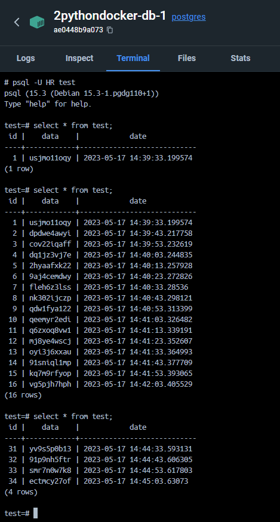
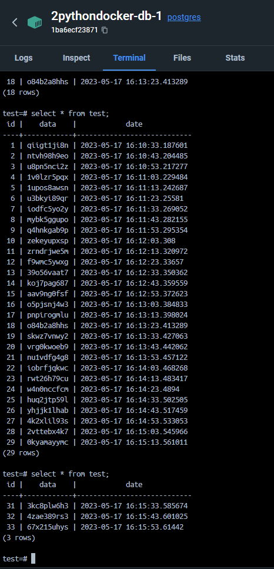

# Задача
1. Создать git проект, в котором должно быть 2 docker контейнера:
    * скрипт python;
    * БД (postgreSQL).

### Алгоритм взаимодействия.
Скрипт каждую минуту отправляет данные в БД cо сгенерированными данными.
Пример данных:
- "id": id записи (инкремент);
- "data": сгенерированная строка данных;
- "date": текущая дата и время.
Скрипт логирует свои действия.

При достижении в таблице БД 30 строк, таблица должна очищаться и вновь пришедшие данные должны быть записаны 1й строчкой. (Можно реализовать на уровне БД или на уровне скрипта)

Проект разворачивается с помощью docker compose.

## Решение
- `main.py` - основной файл скрипта.
- `init.sql` - файл инициализации БД.
- `Dockerfile` - файл для создания контейнера python скрипта.
- `docker-compose` - файл для запуска контейнера с PostgreSQL и скриптом

### Python
1. С помощью библиотеки psycopg2 производим подключение к базе данных.
2. Функция `generate_data()` генерирует данные для вставки в таблицу.
3. Функция `insert_data()` производит вставку данных в таблицу.
4. Функция `clean_data()` производит чистку данных из таблицы, по достижению 30 строк.
5. Скрипт работает циклически. Каждые 10 секунд генерируются данные, происходит вставка, происходит проверка и чистка при необходимости.

#### Пример работы со скриптом

 
### Примечание
Отчистка таблицы, по достижению 30 строк, производится через скрипт.
Это связано с тем, что в последнее время все стремятся логику в бд не хранить.

Допустим, если будет миграция на другую субд, с триггерами и функциями потребуется лишний раз ковыряться, поэтому мигрировать проще со скриптом.
Так же с триггером могут возникнуть различные подводные камни в плане блокировок или еще чего. Хотя триггер обрабатывается быстрее, т.к. более низкоуровневая штука.

При этом со стороны скрипта можно логировать свои действия. Например сохранять логи о том, когда была произведена чистка.

### Функция отчистки на стороне БД

```postgres
CREATE OR REPLACE FUNCTION clean_data()
RETURNS TRIGGER AS $$
BEGIN
    IF (SELECT COUNT(*) FROM test) >= 30 THEN
        DELETE FROM test;
    END IF;
    RETURN NEW;
END;
$$ LANGUAGE plpgsql;

CREATE TRIGGER clean_data_trigger
AFTER INSERT ON test
FOR EACH ROW EXECUTE PROCEDURE clean_data();
```

### Пример работы с триггером
