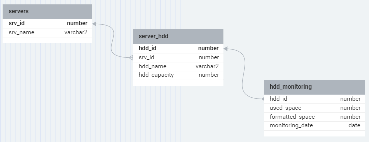

# Дано
Структура данных.
* Таблица серверов: servers, состоит из полей (srv_id, srv_name).
* Таблица накопителей серверов: server_hdd, состоит из полей (hdd_id (integer), srv_id
(integer), hdd_name, hdd_capacity (Общая емкость диска - number)).
* Таблица использования накопителей серверов hdd_monitoring (hdd_id, used_space
(занятая емкость - number), formatted_space (Форматированная емкость - number),
monitoring_date (date)).
Накопителей может быть больше одного.
* Таблицы (servers и server_hdd) связаны посредством foreign_key по полю srv_id.
* Таблицы (server_hdd и hdd_monitoring) связаны посредством foreign_key по полю hdd_id.
# Задача.
1. Вывести серверы, суммарная емкость накопителей которых больше 110 ТБ и менее 130
ТБ. Без использования подзапросов.
2. Вследствие ошибки в таблице server_hdd появились дубли строк.
Предложите вариант удаления дубликатов, оставив только уникальные строки.
3. Какими средствами СУБД Oracle Вы в дальнейшем предотвратили бы появления
дубликатов строк?
4. Вывести изменение занятой емкости на самых больших дисках каждого сервера в
формате:
Имя сервера, Имя диска, Общая емкость диска, Предыдущая занятая емкость, Текущая
занятая емкость диска, Дата мониторинга.
Не более 10 строк на каждый диск.
# Решение
Рассмотрим предложенную структуру базы данных


## Выполнение заданий
1. Вывести серверы, суммарная емкость накопителей которых больше 110 ТБ и менее 130 ТБ. Без использования подзапросов.
    ```postgres
    SELECT s.srv_id, s.srv_name, SUM(sh.hdd_capacity) AS total_capacity
    FROM servers s
    JOIN server_hdd sh ON s.srv_id = sh.srv_id
    GROUP BY s.srv_id, s.srv_name
    HAVING SUM(sh.hdd_capacity) BETWEEN 110000 AND 130000;
    ```
2. Вследствие ошибки в таблице server_hdd появились дубли строк. Предложите вариант удаления дубликатов, оставив только уникальные строки.
    
    Для этого можно использовать ROWID и аналитическую функцию ROW_NUMBER(). Сначала мы идентифицируем дубликаты, затем удаляем их.
    ```postgres
    DELETE FROM server_hdd
    WHERE ROWID NOT IN (
        SELECT MIN(ROWID)
        FROM server_hdd
        GROUP BY hdd_id, srv_id, hdd_name, hdd_capacity
    );
    ```
3. Какими средствами СУБД Oracle Вы в дальнейшем предотвратили бы появления дубликатов строк?

    Для предотвращения дублирования строк можно использовать уникальный составной индекс по полям, которые не должны дублироваться. В данном случае это может быть hdd_id, srv_id, hdd_name и hdd_capacity.

    ```postgres
    CREATE UNIQUE INDEX idx_unique_server_hdd ON server_hdd(hdd_id, srv_id, hdd_name, hdd_capacity);
    ```
4. Вывести изменение занятой емкости на самых больших дисках каждого сервера в формате: Имя сервера, Имя диска, Общая емкость диска, Предыдущая занятая емкость, Текущая занятая емкость диска, Дата мониторинга. Не более 10 строк на каждый диск.
    ```postgres
    SELECT 
        s.srv_name AS "Имя сервера", 
        sh.hdd_name AS "Имя диска", 
        sh.hdd_capacity AS "Общая емкость диска",
        LAG(hm.used_space) OVER (PARTITION BY hm.hdd_id ORDER BY hm.monitoring_date) AS "Предыдущая занятая емкость",
        hm.used_space AS "Текущая занятая емкость диска",
        hm.monitoring_date AS "Дата мониторинга"
    FROM 
        servers s
        JOIN server_hdd sh ON s.srv_id = sh.srv_id
        JOIN hdd_monitoring hm ON sh.hdd_id = hm.hdd_id
        JOIN (
            SELECT hdd_id, MAX(hdd_capacity) AS max_capacity
            FROM server_hdd
            GROUP BY srv_id
        ) msh ON sh.hdd_id = msh.hdd_id AND sh.hdd_capacity = msh.max_capacity
    WHERE 
        ROW_NUMBER() OVER (PARTITION BY hm.hdd_id ORDER BY hm.monitoring_date DESC) <= 10;
    ```
    Этот запрос сначала определяет самый большой диск каждого сервера, а затем выбирает не более 10 последних записей мониторинга для каждого из этих дисков. В результате вы получаете данные о занятой емкости диска с предыдущим значением для сравнения.